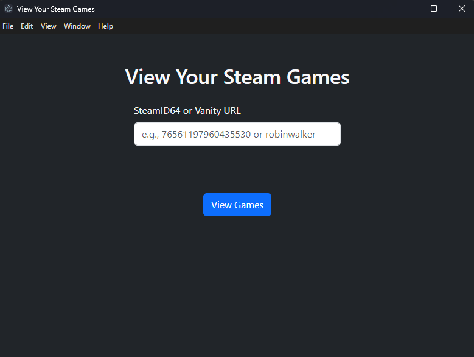
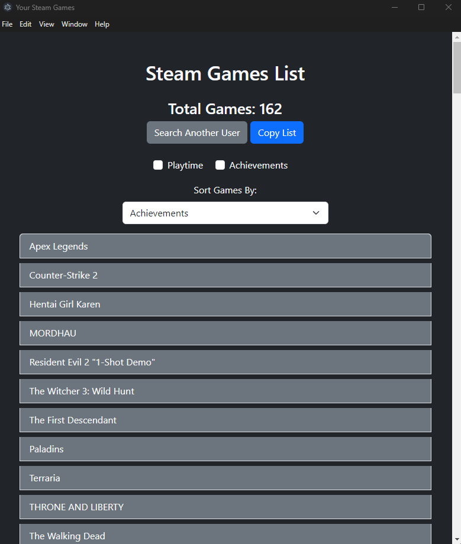
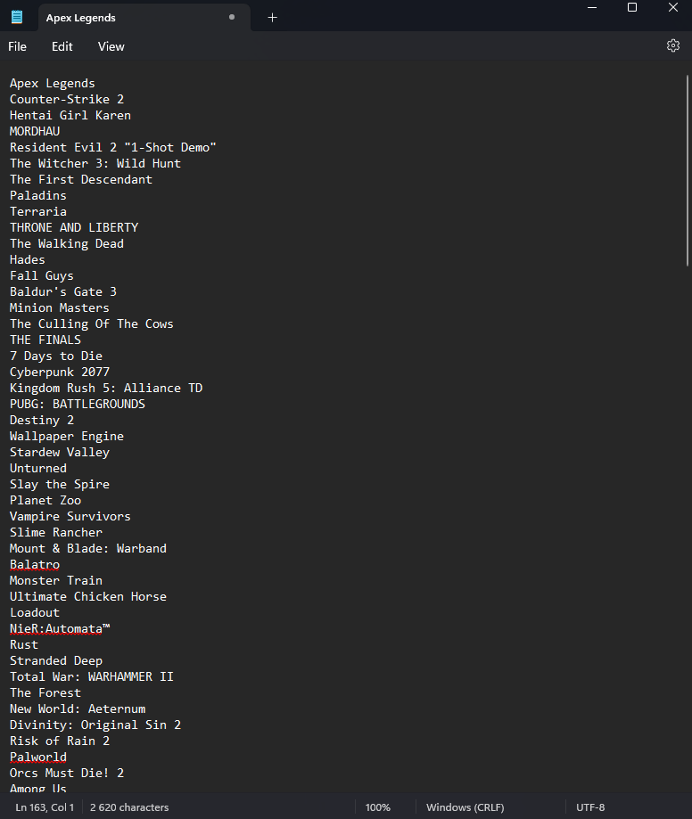

# Steam Games Manager

An Electron app for viewing your Steam games with detailed insights into achievements and playtime. Easily track progress, filter games, and manage your library locally without needing a web browser. Ideal for gamers looking to keep track of their gaming stats in an organized, easy-to-use interface.

The main purpose of this app was to create a convenient, copy-paste-friendly list of all Steam games with optional details.

## Features

- **Copy and Paste Games with Filters**: Quickly copy a list of all games with filters applied, including playtime and achievement progress.
- **View Steam Game Collection**: Displays all games associated with a Steam ID.
- **Track Playtime**: Sort and filter by total playtime to see which games you’ve spent the most time on.
- **Achievements Progress**: Get an overview of each game’s achievement progress as a percentage.
- **Sorting Options**: Sort games by playtime, alphabetical order, or achievement completion.
- **Offline Mode**: View cached game data offline after the first retrieval.
- **Standalone Application**: No web browser needed—runs as a desktop application.

## Screenshots

### Steam ID Entry Screen

### Individual Game Screen Showing Playtime and Achievement Progress

### Game List View with Filters and Sorting

## Installation

1. Go to the **[Releases](https://github.com/your-username/steam-games-manager/releases)** page.
2. Download the latest installer for your operating system.
3. Run the setup file, which will install Steam Games Manager on your computer.

After installation, launch the app, enter your Steam ID or vanity URL.